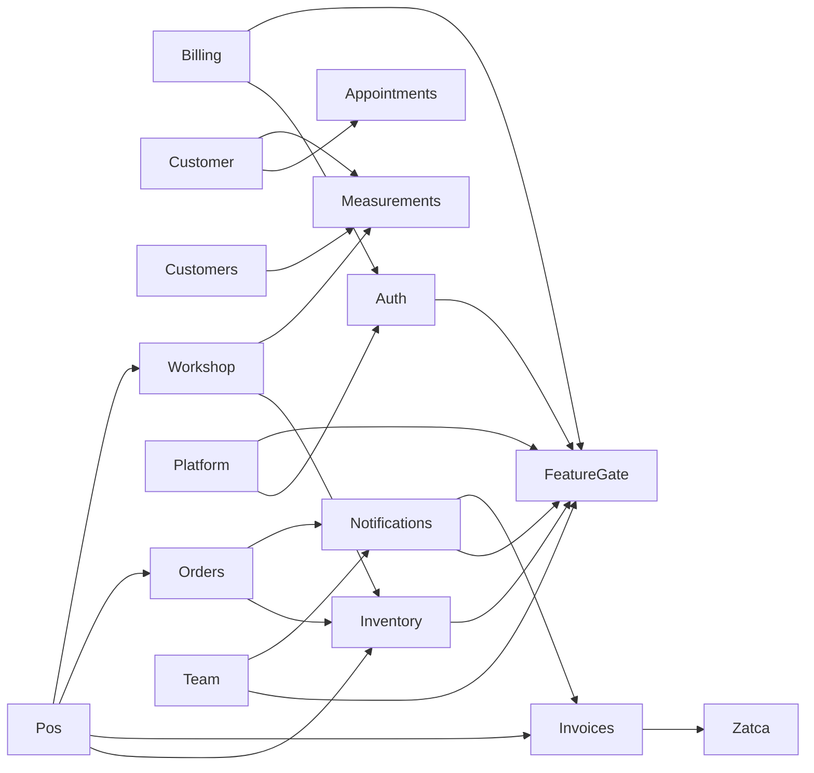

# Tailonix Memory Graph

> **Generated file — do not edit.** Rewritten by `node tools/memory-graph.mjs`,
> which reads git, the Prisma schema, the NestJS module graph, and the decisions
> log. Hand edits are lost on the next run. Judgment that cannot be derived from
> the repo — why something is blocked, what a trap looks like — belongs in the
> auto-memory directory, not here.

**Parent** `0a04164` on `main` · **generated** 2026-08-06 09:57Z · staged into the commit being created on top of it

_History below runs to the parent; the commit carrying this file is its child._

## Drift

No drift. Every decision cited in code exists in the log, every module on disk is
wired into `AppModule`, decision numbering is dense and ordered, and the schema is
not ahead of its migrations.

## Subsystem graph

Edges are `imports:` declarations read out of each `*.module.ts`.

## Applications

| App | Package | Dev port | TS/TSX files | Direct deps |
| --- | --- | --- | --- | --- |
| `apps/admin` | `@tailonix/admin` | 5173 | 34 | 12 |
| `apps/api` | `@tailonix/api` | 3000 | 154 | 24 |
| `apps/platform-admin` | `@tailonix/platform-admin` | 5175 | 15 | 9 |
| `apps/pos` | `@tailonix/pos` | 5176 | 20 | 14 |
| `apps/pwa` | `@tailonix/pwa` | 5174 | 15 | 10 |

## API modules

26 feature modules, all wired into `AppModule`.

| Module | Path | Depends on |
| --- | --- | --- |
| `AppointmentsModule` | `apps/api/src/appointments/appointments.module.ts` | — |
| `AuditModule` | `apps/api/src/audit/audit.module.ts` | — |
| `AuthModule` | `apps/api/src/auth/auth.module.ts` | `FeatureGateModule` |
| `BillingModule` | `apps/api/src/billing/billing.module.ts` | `AuthModule`, `FeatureGateModule` |
| `CommonModule` | `apps/api/src/common/common.module.ts` | — |
| `CustomerModule` | `apps/api/src/customer-api/customer.module.ts` | `AppointmentsModule`, `MeasurementsModule` |
| `CustomersModule` | `apps/api/src/customers/customers.module.ts` | `MeasurementsModule` |
| `DashboardModule` | `apps/api/src/dashboard/dashboard.module.ts` | — |
| `FeatureGateModule` | `apps/api/src/platform/feature-gate.module.ts` | — |
| `HealthModule` | `apps/api/src/health/health.module.ts` | — |
| `InventoryModule` | `apps/api/src/inventory/inventory.module.ts` | `FeatureGateModule` |
| `InvoicesModule` | `apps/api/src/invoices/invoices.module.ts` | `ZatcaModule` |
| `LedgerModule` | `apps/api/src/ledger/ledger.module.ts` | — |
| `MeasurementsModule` | `apps/api/src/measurements/measurements.module.ts` | — |
| `NotificationsModule` | `apps/api/src/notifications/notifications.module.ts` | `InvoicesModule`, `FeatureGateModule` |
| `OrdersModule` | `apps/api/src/orders/orders.module.ts` | `InventoryModule`, `NotificationsModule` |
| `OrganizationModule` | `apps/api/src/organization/organization.module.ts` | — |
| `PlatformModule` | `apps/api/src/platform/platform.module.ts` | `AuthModule`, `FeatureGateModule` |
| `PosModule` | `apps/api/src/pos/pos.module.ts` | `InventoryModule`, `InvoicesModule`, `WorkshopModule`, `OrdersModule` |
| `PrismaModule` | `apps/api/src/prisma/prisma.module.ts` | — |
| `RedisModule` | `apps/api/src/redis/redis.module.ts` | — |
| `StorageModule` | `apps/api/src/storage/storage.module.ts` | — |
| `StoresModule` | `apps/api/src/stores/stores.module.ts` | — |
| `TeamModule` | `apps/api/src/team/team.module.ts` | `NotificationsModule`, `FeatureGateModule` |
| `WorkshopModule` | `apps/api/src/workshop/workshop.module.ts` | `InventoryModule`, `MeasurementsModule` |
| `ZatcaModule` | `apps/api/src/zatca/zatca.module.ts` | — |

## Data model

36 models, 28 enums, 15 migrations.

Models

`Appointment` · `AuditLog` · `Customer` · `CustomerDevice` · `CustomerStoreVisit` · `DocumentCounter` · `FabricReservation` · `InventoryBatch` · `InventoryMovement` · `InventoryReorderSetting` · `InventoryRestockAlert` · `Invitation` · `Invoice` · `JournalEntry` · `LedgerAccount` · `LedgerLine` · `Measurement` · `Notification` · `Order` · `OrderItem` · `OrderItemFabric` · `OrderStatusHistory` · `Organization` · `OrganizationSubscription` · `Payment` · `PlatformAdmin` · `ProductionTicket` · `ProductionTicketHistory` · `RefreshToken` · `Store` · `SubscriptionPlan` · `Supplier` · `User` · `UserStoreRole` · `WhatsappMessage` · `WhatsappTemplate`

| # | Migration |
| --- | --- |
| 1 | `20260724173445_init` |
| 2 | `20260724173510_db_check_constraints` |
| 3 | `20260725000000_stripe_billing_fields` |
| 4 | `20260725010000_dashboard_aggregation_index` |
| 5 | `20260725020000_customer_search_trigram` |
| 6 | `20260725030000_foreign_key_indexes` |
| 7 | `20260725100000_v4_tailoring_amendment` |
| 8 | `20260726000000_double_entry_ledger` |
| 9 | `20260726100000_document_counters` |
| 10 | `20260727102924_add_trouser_measurement_points` |
| 11 | `20260729075052_add_tailor_shop_reference_fields` |
| 12 | `20260729183118_add_zatca_api_secret` |
| 13 | `20260729184725_add_zatca_onboarding_stage` |
| 14 | `20260803000000_split_length_sleeve_trouser_pallas` |
| 15 | `20260804000000_add_org_cr_license_customer_vat_address` |

## Engineering decisions

69 recorded in `docs/ENGINEERING-DECISIONS.md`. "Cited by" counts source
files that reference the decision in a comment — an uncited decision is not wrong,
but it is the first place to look when something has quietly been undone.

| ID | Decision | Cited by |
| --- | --- | --- |
| `D-001` | Staff JWT expiry — PRD vs TRD conflict | — |
| `D-002` | `batch_code` uniqueness — schema bug in TRD | 2 file(s) |
| `D-003` | Base tables the TRD assumes but never defines | 1 file(s) |
| `D-004` | HQ Admin scoping — org-level role vs per-store rows | 3 file(s) |
| `D-005` | PWA framework — Vue vs React left open by TRD | — |
| `D-006` | ORM — TypeORM vs Prisma left open by TRD | — |
| `D-007` | Negative stock prevention "at database level" | 1 file(s) |
| `D-008` | Store timezone for the 8 AM reorder cron | 2 file(s) |
| `D-009` | OTP length — 4 digits per wireframes | 1 file(s) |
| `D-010` | Order number & status model | 3 file(s) |
| `D-011` | Dev-first infrastructure | — |
| `D-012` | Monorepo layout | — |
| `D-013` | Customer identity | 1 file(s) |
| `D-014` | Validation library | — |
| `D-015` | Notification channel priority and fallback | — |
| `D-016` | `validateEnv` must return the whole config | — |
| `D-017` | Service worker owns push (Workbox `injectManifest`) | — |
| `D-018` | Stripe is the source of truth for subscription state | 2 file(s) |
| `D-019` | Stripe SDK v22 field relocations | — |
| `D-020` | Billing degrades, it does not crash | 1 file(s) |
| `D-021` | Invoice PDFs are Latin-only for now — **superseded by D-040** | — |
| `D-022` | Invoices are generated, not stored-and-served | — |
| `D-023` | Invoicing triggers on delivery | — |
| `D-024` | Partial covering index for the dashboard aggregation | 2 file(s) |
| `D-025` | Trigram indexes for substring search | 2 file(s) |
| `D-026` | Index every foreign key | 1 file(s) |
| `D-027` | Measurements become a versioned matrix, enforced by the database | — |
| `D-028` | VAT is derived by subtraction, not by re-multiplication | — |
| `D-029` | ZATCA Phase 2 — what is implemented and what needs onboarding | 2 file(s) |
| `D-030` | Compliance verification needs hash re-computation, not just chain linkage | — |
| `D-031` | Reserve at checkout, deduct at cutting | — |
| `D-032` | Yield is computed from the customer's own active measurements | — |
| `D-033` | POS checkout is one call, not a wizard of independent endpoints | — |
| `D-034` | The POS is a separate app, not a section of the admin SPA | — |
| `D-035` | Returning a pre-update row printed the wrong balance | — |
| `D-036` | The blueprint states the deposit posting backwards | 4 file(s) |
| `D-037` | VAT on split payments is a remainder, not a per-payment split | 2 file(s) |
| `D-038` | Document numbers need an atomic counter, not `count(*) + 1` | 3 file(s) |
| `D-039` | `FOR UPDATE` on the latest row does not serialise inserts | 1 file(s) |
| `D-040` | Arabic invoices need a font, not a shaping engine | 2 file(s) |
| `D-041` | Creating an invoice issues it; the PDF is rendered after | 1 file(s) |
| `D-042` | The invoice footer anchors to the page box, not a constant | 1 file(s) |
| `D-043` | POS and the workshop get their own permissions | 2 file(s) |
| `D-044` | One read model for measurements, and it is read-only | 2 file(s) |
| `D-045` | The counter can browse and search customers, not just look one up exactly | 1 file(s) |
| `D-046` | The counter registers walk-ins itself, no admin round-trip | 5 file(s) |
| `D-047` | Print Center — thermal, garment-tag barcodes, and the A4 invoice are three documents, not one | 5 file(s) |
| `D-048` | `cashier` needs `view_inventory` because checkout structurally requires it | 2 file(s) |
| `D-049` | The Print Center's first shipped version was never actually print-tested | 1 file(s) |
| `D-050` | The A4 button downloads a file, it does not try to open a tab | 2 file(s) |
| `D-051` | Counter can find, reprint, and settle a past order — and a full settlement closes it | 9 file(s) |
| `D-052` | Measurement, yield, and fabric-roll selection were silently hardcoded to Thobe | — |
| `D-053` | Checkout now sends the discount, due date, notes, and deposit-method fields the DTO already accepted | — |
| `D-054` | Trousers gets its own measurement matrix, diagram and yield formula — not Thobe's, relabeled | 12 file(s) |
| `D-055` | Five more Thobe measurement points, a cut-style/cufflink spec, and an urgent flag — read off a real tailor shop's own paper order form | 8 file(s) |
| `D-056` | The measurement diagram moved every hotspot off the garment into labelled columns | — |
| `D-057` | ZATCA Phase 2 — real XAdES signing, CSR generation, and the Reporting/Clearance client | 12 file(s) |
| `D-058` | ZATCA onboarding orchestration — three explicit steps, a permission that didn't exist, and one deliberate non-feature | 10 file(s) |
| `D-059` | A real ZATCA primary source arrived — corrects the CSR structure, the wire shapes, and renewal | 4 file(s) |
| `D-060` | Platform Admin finalized — three real bugs, three missing features, and the module's first tests | 23 file(s) |
| `D-061` | First real deploy attempt exposed five gaps a dev-only setup never surfaces | 1 file(s) |
| `D-062` | Finalizing admin found the same shape of gap as platform-admin — backend built, no UI | 9 file(s) |
| `D-063` | Team onboarding gets a "set password now" mode alongside email invites | 1 file(s) |
| `D-064` | POS checkout let a customer's own fabric block the sale entirely | 1 file(s) |
| `D-065` | A brand-new tenant's first cash sale could fail outright | 3 file(s) |
| `D-066` | POS audit — Workshop cards didn't open, garment tags didn't print, every role saw every screen | 2 file(s) |
| `D-067` | Production Redis was never actually reachable — silently, since the first deploy | — |
| `D-068` | M1/M3 split into front/back and left/right, plus an open-ended trouser palla list | 11 file(s) |
| `D-069` | A competitor's receipt showed what ours was missing — CR/license number, a logo, buyer VAT | 13 file(s) |

## Tests

| Suite | Files | Declared cases |
| --- | --- | --- |
| unit | 26 | 287 |
| e2e | 0 | 0 |

Counts are parsed from `it(` / `test(` call sites, so they include any case that is
currently skipped. They are a shape check, not a substitute for running the suite.

## History

| Commit | Date | Subject |
| --- | --- | --- |
| `0a04164` | 2026-08-03 | Split M1/M3 measurements into front/back and left/right, add trouser palla list (D-068) |
| `7d3fe1c` | 2026-08-03 | Add TLS support for managed Redis, fixing a production Redis outage (D-067) |
| `539cbb7` | 2026-08-02 | Audit and finalize POS module: Workshop clicks, garment-tag print, role-aware nav (D-066) |
| `86afe0d` | 2026-08-02 | Provision the chart of accounts at tenant creation, not on first Ledger visit (D-065) |
| `d773289` | 2026-08-02 | Allow POS checkout without a fabric roll for customer-supplied material (D-064) |
| `15e9417` | 2026-08-02 | Add direct email+password team onboarding alongside email invites (D-063) |
| `ae69f2b` | 2026-08-01 | Finalize admin: tenant self-serve billing, ledger, invoices list, WhatsApp config (D-062) |
| `156e6b6` | 2026-08-01 | Add opt-in platform admin bootstrap seed for first production deploy |
| `25be863` | 2026-08-01 | Fix: reorder-cron's blocking Redis await made the whole API unreachable, not just cron |
| `f383753` | 2026-08-01 | Document D-061: Railway deployment readiness fixes |
| `ec7e69d` | 2026-08-01 | Make the API and all four SPAs deployable on Railway (D-061) |
| `09e38cc` | 2026-08-01 | Finalize Platform Admin: fix 3 real bugs, add account management/metrics/billing history, full test coverage (D-060) |
| `7079c76` | 2026-08-01 | Complete ZATCA Fatoora Phase 2 e-invoicing integration (D-057-059) |
| `2e76296` | 2026-08-01 | Add trouser measurements, tailor-shop reference fields, and Print Center reprint/settle flow (D-051-056) |
| `a513690` | 2026-07-27 | Make the A4 button download a file instead of trying to open a tab |
| `3c157ae` | 2026-07-27 | Fix Print Center: nav bar bleeding into every print, invalid @page, blocked A4 popup |
| `4a941c2` | 2026-07-27 | Let the counter register walk-ins and print a full Print Center |
| `ebbc49b` | 2026-07-27 | Add rush-hour customer search to Counter (directory + name/phone search) |
| `c07ca9c` | 2026-07-26 | Fix invoice page overflow; split POS/workshop RBAC; open up measurements |
| `fff88f3` | 2026-07-26 | Drop the hook pre-filter that was missing real commits |
| `252b394` | 2026-07-26 | Make the printed invoice a valid KSA tax invoice |
| `b685805` | 2026-07-26 | @ Stop the graph hook from dirtying the index on unrelated commands |
| `871ab64` | 2026-07-26 | @ Label the graph header honestly when it is generated pre-commit |
| `6975af1` | 2026-07-26 | @ Derive the project memory graph from the repo instead of recalling it |
| `b137d23` | 2026-07-26 | Fix two concurrency bugs found by load-testing the counter |
| `21a995b` | 2026-07-26 | Add double-entry ledger: deposits as liability, realised on handover |
| `1748eb1` | 2026-07-26 | Add tablet POS app: counter flow, measurement diagram, workshop Kanban |
| `d8d326a` | 2026-07-25 | v4: yield engine, fabric reservations, workshop Kanban, POS checkout |
| `0283a3a` | 2026-07-25 | v4 amendment: KSA tailoring domain + ZATCA Fatoora Phase 2 |
| `2076c4a` | 2026-07-25 | Profile at PRD scale; fix three index problems found |
| `410df3b` | 2026-07-25 | Add invoice PDF generation, object storage, and WhatsApp document send |
| `7e0a776` | 2026-07-25 | Add Stripe subscription billing and fix broken invitation link |
| `79a92be` | 2026-07-25 | Add email digests for low stock and staff invitations |
| `8b1c00a` | 2026-07-25 | Add web push delivery and fix env config stripping undeclared vars |
| `9719c9e` | 2026-07-25 | Add i18n and native RTL support (en/ar/ur) |
| `8b5283c` | 2026-07-25 | Add customers module, e2e tests, and CI e2e stage |
| `27fcde1` | 2026-07-24 | Initial implementation: Tailonix multi-tenant tailoring platform |

